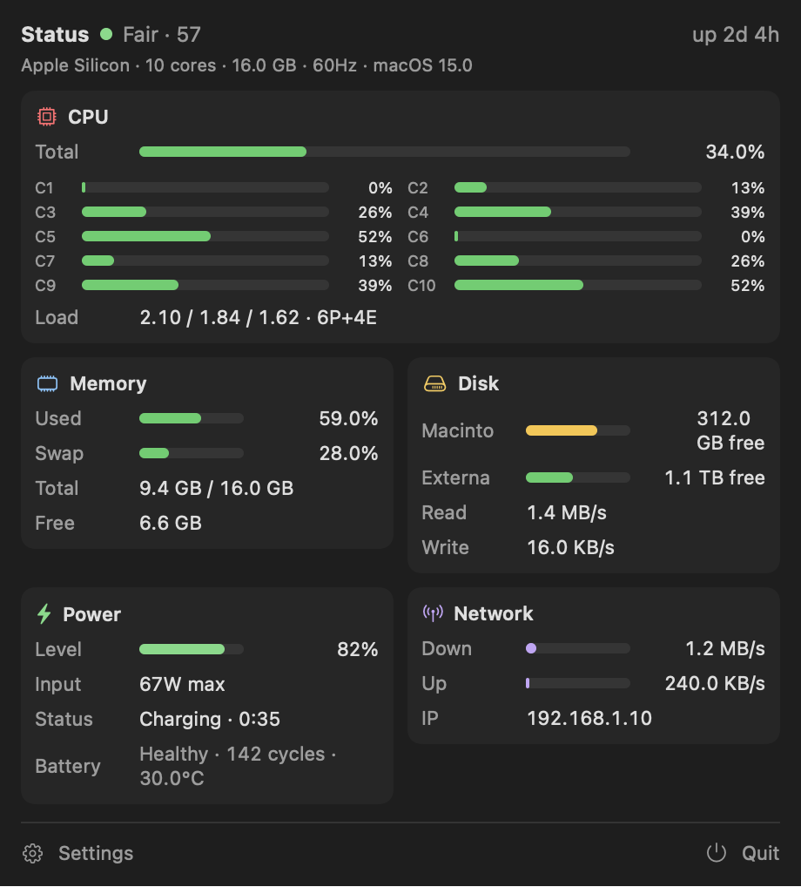

<h1 align="center">StatusAppBar</h1>

<p align="center">
  A lightweight, native macOS <strong>menu bar system monitor</strong> — live CPU, memory, disk, power and network stats, right where you can always see them.
</p>

<p align="center">
  
  
  
  
</p>

<p align="center">
  
</p>

---

## What is it?

StatusAppBar puts a compact, **always-live** readout in your macOS menu bar. Click it to open a full panel with detailed CPU, memory, disk, power and network metrics — no terminal, no Dock icon, no background bloat.

It reads everything straight from the kernel (Mach, IOKit, BSD sockets), so there are **zero third-party dependencies** and a tiny footprint.

The menu bar shows whichever metrics you choose, and it **turns red as the system approaches full load** so you can spot pressure at a glance:

| Normal | Under load |
|--------|------------|
|  |  |

> Screenshots are rendered from representative sample data.

## Features

- **Live updates** every second — including while the panel is open.
- **Load-aware color** — the menu bar readout is dim and unobtrusive when the system is calm, and ramps to red as CPU load climbs.
- **Stable layout** — fixed-width, monospaced fields so the indicator never jiggles left/right as numbers change.
- **Customizable menu bar** — choose which of CPU / RAM / Disk I/O / Network to show, with or without icons.
- **Full detail panel** with five sections:
  - **CPU** — total %, per-core bars, load average, P+E core split
  - **Memory** — used / swap / total / free (Activity Monitor-style accounting)
  - **Disk** — per-volume usage + live read/write throughput
  - **Power** — battery level, adapter wattage, charge state, cycle count, health, temperature
  - **Network** — live down/up throughput + local IP
- **Overall health score** (0–100) with tunable weights.
- **Launch at login** — one toggle in Settings (uses the modern `SMAppService` API).
- **No Dock icon**, no window clutter — pure menu bar app.

## Requirements

- macOS 14 (Sonoma) or later
- Swift 5.9+ / Xcode 15+ (only to build from source)

## Install

### Download (prebuilt)

1. Download `StatusAppBar.zip` from the [**Releases**](https://github.com/salihgencer/StatusAppBar/releases) page and unzip it.
2. Move `StatusAppBar.app` to `/Applications`.
3. The app is **ad-hoc signed, not notarized** (no paid Apple Developer account), so Gatekeeper blocks it on first launch. Allow it once:

   ```bash
   xattr -dr com.apple.quarantine /Applications/StatusAppBar.app
   ```

   …then open it normally. (Alternatively: right-click the app → **Open** → **Open**.)

### Build from source

```bash
git clone https://github.com/salihgencer/StatusAppBar.git
cd StatusAppBar
./build.sh        # release build, bundled into StatusAppBar.app
open StatusAppBar.app
```

Or run it directly during development (no bundle, no Dock icon):

```bash
swift run
```

### Launch at login

Open the panel → **Settings** → enable **Açılışta başlat** (*Launch at login*).
You can also add it manually via **System Settings → General → Login Items**.

## Usage

- **Click** the menu bar item to open the detail panel.
- Click **Settings** in the panel to choose which metrics appear in the bar, toggle icons, and set the refresh interval (1 / 2 / 5 s).
- Click **Quit** to exit.

## How it works

All metrics are read directly from the OS — no shelling out, no dependencies:

| Metric   | Source |
|----------|--------|
| CPU      | Mach `host_processor_info` (tick deltas) + `getloadavg` |
| Memory   | Mach `host_statistics64` (VM stats) + `vm.swapusage` |
| Disk     | `URLResourceValues` (volumes) + IOKit `IOBlockStorageDriver` (throughput) |
| Power    | `IOPowerSources` + IOKit `AppleSmartBattery` |
| Network  | `getifaddrs` (`if_data` byte deltas) |

### Architecture

```
Monitor.sample()  ─▶  XMetrics (value type)
                          │
                          ▼
                  MetricsManager   (samples on a background queue, publishes @Published)
                          │
                          ▼
                  SwiftUI  (MenuBarExtra label  +  PopoverView panels)
```

Each metric lives in its own `Monitor` that holds the previous sample and computes
rates from deltas. `MetricsManager` drives them on a timer and publishes snapshots;
SwiftUI renders the menu bar label and the panel. Adding a new metric is just a new
`Monitor` + a section view.

### Health score

The overall score lives in [`Sources/StatusAppBar/HealthScore.swift`](Sources/StatusAppBar/HealthScore.swift)
and is intentionally simple to tune:

```
pressure = cpu*0.35 + ram*0.30 + disk*0.20 + temp*0.15
score    = (1 - pressure) * 100
```

Adjust the weights to match what "healthy" means for your workflow.

## Contributing

Issues and PRs are welcome. Some good first additions:

- A **Processes** panel (top CPU / memory consumers)
- Mini **sparkline** graphs in the menu bar
- A native **Settings** window / preferences pane
- Configurable thresholds and color ramps

## License

[MIT](LICENSE) © Salih Gencer
