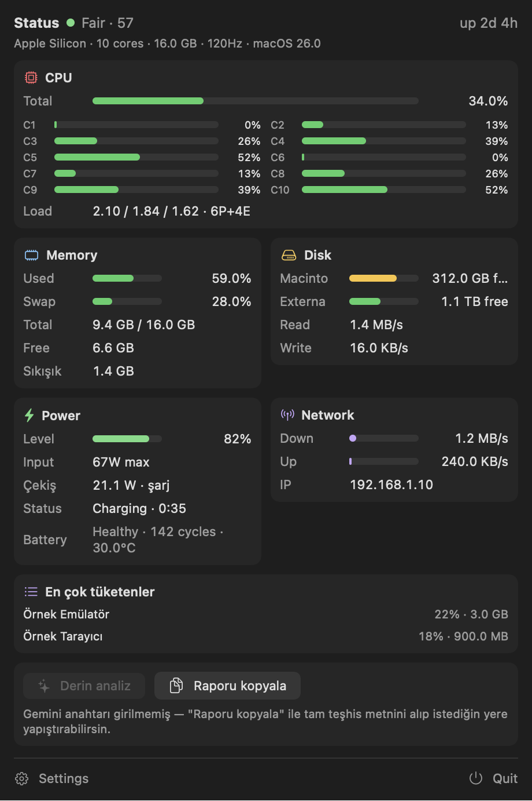

<h1 align="center">StatusAppBar</h1>

<p align="center">
  A lightweight, native macOS <strong>menu bar system monitor</strong> — live CPU, memory, disk, power and network stats, right where you can always see them.
</p>

<p align="center">
  
  
  
  
</p>

<p align="center">
  
</p>

---

## What is it?

StatusAppBar puts a compact, **always-live** readout in your macOS menu bar. Click it to open a full panel with detailed CPU, memory, disk, power and network metrics — no terminal, no Dock icon, no background bloat.

It reads everything straight from the kernel (Mach, IOKit, BSD sockets), so there are **zero third-party dependencies** and a tiny footprint.

The menu bar shows whichever metrics you choose, and it **turns red as the system approaches full load** so you can spot pressure at a glance:

| Normal | Under load |
|--------|------------|
|  |  |

> Screenshots are rendered from representative sample data.

## Features

- **Live updates** every second — including while the panel is open.
- **Load-aware color** — the menu bar readout is dim and unobtrusive when the system is calm, and ramps to red as CPU load climbs.
- **Stable layout** — fixed-width, monospaced fields so the indicator never jiggles left/right as numbers change.
- **Customizable menu bar** — choose which of CPU / RAM / Disk I/O / Network to show, with or without icons.
- **Full detail panel** with five sections:
  - **CPU** — total %, per-core bars, load average, P+E core split
  - **Memory** — used / swap / total / free (Activity Monitor-style accounting)
  - **Disk** — per-volume usage + live read/write throughput
  - **Power** — battery level, adapter wattage, charge state, cycle count, health, temperature
  - **Network** — live down/up throughput + local IP
- **Overall health score** (0–100) with tunable weights.
- **Launch at login** — one toggle in Settings (uses the modern `SMAppService` API).
- **No Dock icon**, no window clutter — pure menu bar app.

### Alerts (v1.3)

StatusAppBar now watches for the conditions that actually make a Mac hot, slow and
short on battery — and tells you **which process is responsible**.

| Rule | Fires when | Clears at | Must persist |
|------|-----------|-----------|--------------|
| **Memory pressure** | swap ≥ 75 % | < 60 % | 60 s |
| **CPU hog** | one process ≥ 200 % | < 100 % | 180 s |
| **Thermal / kernel_task** | `thermalState` ≥ *serious* or `kernel_task` ≥ 25 % | nominal & < 10 % | 90 s |
| **Long uptime** | uptime ≥ 7 d or WindowServer ≥ 1.2 GB | after reboot | — |
| **Battery drain** | ≥ 20 W while discharging | < 12 W or on AC | 120 s |

Three mechanisms keep it from becoming noise:

- **Hysteresis** — trigger and clear thresholds differ, so a value hovering at the
  edge doesn't flap the alert on and off.
- **Dwell** — the condition must hold continuously before anything is sent. Build
  spikes and app launches never reach your notification centre.
- **Cooldown** — a per-rule minimum gap (default 30 min) between notifications. The
  alert stays visible in the panel; it just stops re-notifying.

When a condition clears you get a short **"back to normal"** notification, because an
alert system you can't trust to tell you it's over is an alert system you stop reading.

Every alert names the culprit process, its PID and its footprint. The **CPU hog** rule
additionally requires the *same* PID for the whole dwell window — otherwise "some
process was busy" isn't a finding.

### Adaptive menu bar width

On notched MacBooks the usable menu bar ends at the notch. A wide readout plus a few
other menu bar apps pushes the item *underneath* the notch — the app is running, but
**nothing is visible**, and macOS gives no API to detect it.

The default mode is now **Adaptive**: a single ~12 px coloured dot while things are
calm, expanding to show the most-pressured metric when stress rises or an alert fires.
`Dot` / `Compact` / `Full` are also selectable.

### Deep analysis (AI) — App Store version only

> The deep-analysis feature is exclusive to the **paid Mac App Store version** of StatusAppBar. The free GitHub build does not include it.

The **Deep analysis** button sends a snapshot — metrics, top processes, active alerts — to an AI provider and returns a prioritised diagnosis, then opens a **chat window** where you can ask follow-up questions ("which of these should I kill first?", "is 91% swap actually a problem?"). Answers **stream in live**, token by token.

**Bring your own provider** — Gemini, Claude (Anthropic), OpenAI, or a local **Ollama** / **LM Studio** server (nothing leaves your Mac with a local provider). Settings can validate your key and list the available models to pick from.

The model is not stuck with the initial snapshot: it has **tools** and can pull the *current* system status or process list at any point in the conversation, open Activity Monitor for you, and — only with your explicit on-screen confirmation — terminate a runaway process. A **"current status"** button pushes a fresh snapshot into an ongoing chat at any time.

It runs only when you press it; there is no background polling. The chat lives in a **separate resizable window**, not in the panel: `MenuBarExtra` dismisses itself the moment it loses focus, and losing a conversation mid-sentence to a stray click is not acceptable. **Copy transcript** deliberately excludes the system report and tool outputs, so sharing a conversation doesn't also share your IP, disk names and process list.

**Cloud by default, deliberately not a bundled local model.** A bundled LLM wants 6–10 GB of RAM, and the main thing this app watches *is* RAM exhaustion. A diagnostic tool must not aggravate the condition it diagnoses. (Your own Ollama/LM Studio server is your choice to make — and supported.)

No provider configured? **Copy report** puts the full diagnostic text on your clipboard for any tool you like.

## Requirements

- macOS 14 (Sonoma) or later
- Swift 5.9+ / Xcode 15+ (only to build from source)

## Install

### Download (prebuilt)

The free GitHub build is for **non-commercial use** (see [License](#license)). The full-featured version — including AI deep analysis — will be available on the **Mac App Store** (launch in progress).

1. Download `StatusAppBar.zip` from the [**Releases**](https://github.com/salihgencer/StatusAppBar/releases) page and unzip it.
2. Move `StatusAppBar.app` to `/Applications`.
3. The app is **ad-hoc signed, not notarized** (no paid Apple Developer account), so Gatekeeper blocks it on first launch. Allow it once:

   ```bash
   xattr -dr com.apple.quarantine /Applications/StatusAppBar.app
   ```

   …then open it normally. (Alternatively: right-click the app → **Open** → **Open**.)

### Build from source

```bash
git clone https://github.com/salihgencer/StatusAppBar.git
cd StatusAppBar
./build.sh        # release build, bundled into StatusAppBar.app
open StatusAppBar.app
```

Or run it directly during development (no bundle, no Dock icon):

```bash
swift run
```

### Launch at login

Open the panel → **Settings** → enable **Açılışta başlat** (*Launch at login*).
You can also add it manually via **System Settings → General → Login Items**.

## Usage

- **Click** the menu bar item to open the detail panel.
- Click **Settings** in the panel to choose which metrics appear in the bar, toggle icons, and set the refresh interval (1 / 2 / 5 s).
- Click **Quit** to exit.

## How it works

All metrics are read directly from the OS — no shelling out, no dependencies:

| Metric   | Source |
|----------|--------|
| CPU      | Mach `host_processor_info` (tick deltas) + `getloadavg` |
| Memory   | Mach `host_statistics64` (VM stats) + `vm.swapusage` |
| Disk     | `URLResourceValues` (volumes) + IOKit `IOBlockStorageDriver` (throughput) |
| Power    | `IOPowerSources` + IOKit `AppleSmartBattery` (incl. instant W draw) |
| Network  | `getifaddrs` (`if_data` byte deltas) |
| Thermal  | `ProcessInfo.thermalState` |
| Processes| `ps` every 10 s (see note) |

**Why `ps` for processes.** `proc_pidinfo(PROC_PIDTASKINFO)` needs privileges for
processes owned by other users — which is exactly `kernel_task` (root) and
`WindowServer` (`_windowserver`), the two this app most needs to watch. `ps` reads the
same data unprivileged via sysctl. It costs one ~30 ms subprocess every 10 s, kept off
the 1 s metric loop on purpose.

### Notifications on an unsigned build

`UNUserNotificationCenter` returns `UNErrorDomain Code=1 "Notifications are not allowed
for this application"` for this app on macOS 26 — verified against a fresh bundle ID, a
full `Info.plist`, an app icon, explicit `lsregister`, and a real *Apple Development*
signing identity. None of them change the result; a Developer ID / notarised build is
what the system wants.

So there is a fallback: `osascript display notification`. It works — messages are
delivered — but they're attributed to **Script Editor** rather than StatusAppBar.
Settings shows which path is live, and **Send test notification** lets you verify the
chain end to end instead of finding out by missing an alert.

### Its own footprint

Rendering the menu bar label through `ImageRenderer` on every sample made v1.2 one of
the top CPU consumers on a busy machine — a monitoring tool becoming part of the
problem. v1.3 caches the rendered image and only redraws when the drawn content
actually changes, and the default interval moved 1 s → 2 s.

Measured on the same machine, same workload: **7.4 % → 0.3 % CPU**.

### Architecture

```
Monitor.sample()  ─▶  XMetrics (value type)
                          │
                          ▼
                  MetricsManager   (samples on a background queue, publishes @Published)
                          │
                          ▼
                  SwiftUI  (MenuBarExtra label  +  PopoverView panels)
```

Each metric lives in its own `Monitor` that holds the previous sample and computes
rates from deltas. `MetricsManager` drives them on a timer and publishes snapshots;
SwiftUI renders the menu bar label and the panel. Adding a new metric is just a new
`Monitor` + a section view.

### Health score

The overall score lives in [`Sources/StatusAppBar/HealthScore.swift`](Sources/StatusAppBar/HealthScore.swift)
and is intentionally simple to tune:

```
pressure = cpu*0.35 + ram*0.30 + disk*0.20 + temp*0.15
score    = (1 - pressure) * 100
```

Adjust the weights to match what "healthy" means for your workflow.

## Contributing

Issues and PRs are welcome. Some good first additions:

- A **Processes** panel (top CPU / memory consumers)
- Mini **sparkline** graphs in the menu bar
- A native **Settings** window / preferences pane
- Configurable thresholds and color ramps

## License

[PolyForm Noncommercial 1.0.0](LICENSE) © Salih Gencer — kişisel ve ticari olmayan kullanım serbest. **Ticari kullanım için** Mac App Store sürümünü satın alın (yakında).

> Not: v1.3 ve öncesi MIT lisansıyla yayınlanmıştı; bu sürümleri MIT koşullarıyla almış olanlar için MIT geçerliliğini korur. PolyForm lisansı bu sürümden itibaren geçerlidir.
